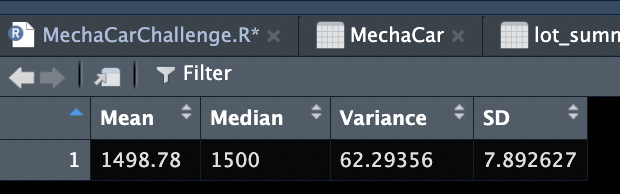
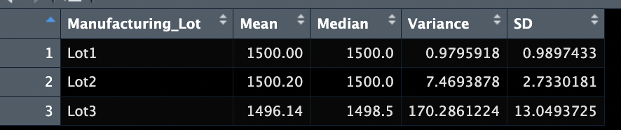

# MechaCar_Statistical_Analysis
Using R, design a statistical study to compare vehicle performance of the MechaCar vehicles against vehicles from other manufacturers.

## Overview
AutosRUs’ newest prototype, the MechaCar, is suffering from production troubles that are blocking the manufacturing team’s progress. This project will allow AutosRUs’ upper management to review the production data for insights that may help the manufacturing team.

## Resources
- Data Source: MechaCar_mpg.csv, Suspension_Coil.csv
- Software: RStudio, R, dplyr

## Linear Regression to Predict MPG

 

- The variables/coefficients that provided a non-random amount of variance to the mpg values in the dataset are vehicle weight, spoiler angle, and AWD. This variables all had a Pr(>|t|) value greater than 0.05. Both ground clearance and vehicle length had a Pr(>|t|) less than 0.05, this means they provide to the random amount of variance.
- The P value of 0.00000000005 is very close to zero due to the small p-value.
- The r-squared value of the linear model correctly predicts mpg of MechaCar prototypes 71% of the time.

## Summary Statistics on Suspension Coils

### **Total Summary:**

### **Lot Summary:**

The design specifications for the MechaCar suspension coils dictate that the variance of the suspension coils must not exceed 100 pounds per square inch. Does the current manufacturing data meet this design specification for all manufacturing lots in total and each lot individually? Why or why not?

## T-Tests on Suspension Coils

### **Summary T-test:**
 
 
### **Individual T-tests:**
 
 
briefly summarize your interpretation and findings for the t-test results. Include screenshots of the t-test to support your summary.
 
 

## Study Design: MechaCar vs Competition.

design a statistical study to compare performance of the MechaCar vehicles against performance of vehicles from other manufacturers.

Write a short description of a statistical study that can quantify how the MechaCar performs against the competition. In your study design, think critically about what metrics would be of interest to a consumer: for a few examples, cost, city or highway fuel efficiency, horse power, maintenance cost, or safety rating.

In your description, address the following questions:

What metric or metrics are you going to test?

What is the null hypothesis or alternative hypothesis?

What statistical test would you use to test the hypothesis? And why?

What data is needed to run the statistical test?
